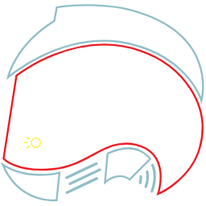

<p align="center">
  
</p>

## Summary

This logo was created for the Tram-One Project, it was designed by [Daniel Jurman](https://danieljurman.com/).

## Usage

### Site

You can view and download any version of the assets by going to https://tram-one.io/tram-logo

### Unpkg

You can use any of the assets in your projects by directly referencing the assets from unpkg.com.

```html

```

By default unpkg.com will redirect you to the Tram-One svg. You can also point to any other SVG or PNG, [see here](https://tram-one.io/tram-logo) for different assets available.

```html

```

### npm

You can install the package from npm to also have the assets locally.

```sh
npm i @tram-one/tram-logo
```

From there, you can reference any asset in your node_modules.

```html

```

### Variants

There are several variants, which change the styling of the logo. The CSS for creating these are available in the `variants/` folder, and are included in all of the above downloading methods.

The URL for all of these will be something like: `color.svg`, `color_64.png`, `color_128.png`,`color_512.png`.
You can see all of the assets [on the Tram Logo site](https://tram-one.io/tram-logo)

| Version  | URL             | Preview                          |
| -------- | --------------- | -------------------------------- |
| Original | /dist/color\_\* |  |
| Neon     | /dist/neon\_\*  |   |
| Black    | /dist/black\_\* |  |
| Lite     | /dist/lite\_\*  |   |

## Development

To run the project, simply run:

```sh
npm start
```

To download all assets, run the following in the dev console:

```js
downloadAllImages();
```

This will go through each variant and size, and download every png and svg.
You can then move these assets to the dist folder.
